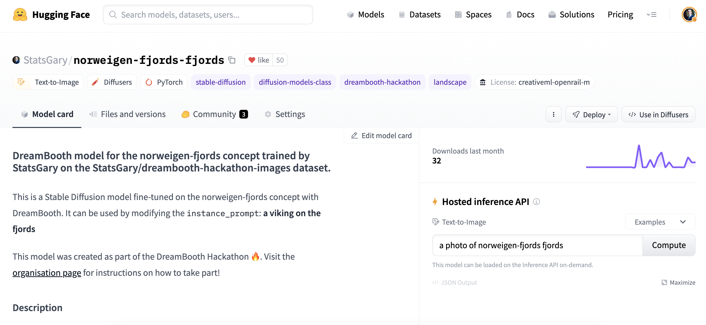
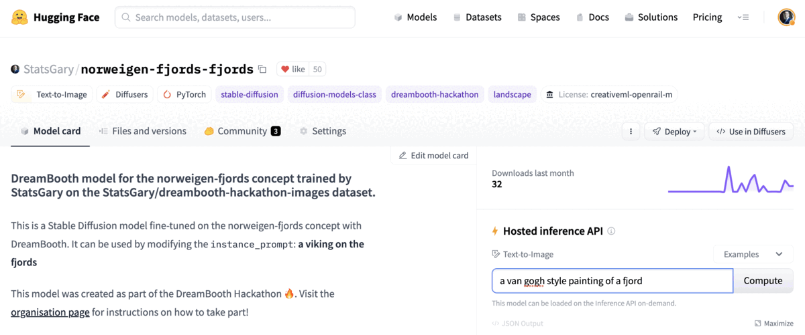
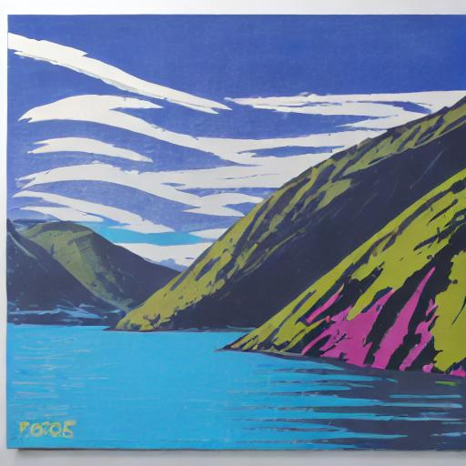

# Dreambooth Fine Tuning with PyTorch


This is a repository to support the Dreambooth fine tuning presentation for the May 2023 meetup: https://www.meetup.com/leeds-data-science-meetup/events/292450739/. 

## Getting setup

1. To get setup, you must create a `virtual environment` with your favourite environment provider, whether that be `pyenv`, `poetry`, `anaconda` or `virtualenv`.
2. Once created, you must install the requirements.txt: 

```{python}
pip install -r requirements.txt
```
3. This will provide you with all the packages you need. However, you must have a GPU that is CUDA compatible installed on your machine to enable fine tuning
4. This package use `bitsandbytes` for acceleration and using 8 bit torch optimizers, please refer to this package, if you get any problems running these scripts, as they depend on this for memory optimisation. See: https://github.com/TimDettmers/bitsandbytes.

## Creating HuggingFace account

A HuggingFace account is needed to work with this tutorial. See the steps on how to create an account: https://huggingface.co/docs/huggingface_hub/quick-start.

## Access to model deployed 

The example model I created on HuggingFace can be found here: https://huggingface.co/StatsGary/norweigen-fjords-fjords. 

This allows you to generate images of Fjords with various diffusion generated objects, as we have covered in the tutorial, however you should be able to generate any of your concept images:


## Push your own images to HuggingFace Datasets

To push your own images to HuggingFace Datasets, you need to store the images in an image folder and then use the below Python script to achieve that goal: 

```python
from datasets import load_dataset
dataset = load_dataset('imagefolder', data_dir='images/<your image set>')
dataset.push_to_hub('<name to be displayed in HF>')
```

You will then be able to find them in your account, under datasets, see an example of the images for the example presentation: https://huggingface.co/datasets/StatsGary/dreambooth-hackathon-images.

## Loading images from the stored location

To load, I have implemented in the `dreambooth_train.py` file a routine to pull them down, this simply connects to the HuggingFace API (via token authentication) and retrieves my images from the respective location. 

```python
from datasets import load_dataset
# Change dataset ID to your HuggingFace image ID
dataset_id = "StatsGary/dreambooth-hackathon-images"  
dataset = load_dataset(dataset_id, split="train")
dataset
```

## Visualising images as a grid

In the dreambooth module I have created for this tutorial, there is an image module with a routine called `image_grid` that can be used to show a sample of images to get a sense of the variety, the implementation is simply: 

```python
from PIL import Image
def image_grid(imgs, rows, cols):
    assert len(imgs) == rows * cols
    w, h = imgs[0].size
    grid = Image.new("RGB", size=(cols * w, rows * h))
    grid_w, grid_h = grid.size
    for i, img in enumerate(imgs):
        grid.paste(img, box=(i % cols * w, i // cols * h))
    return grid

# Choose number of samples to display
num_samples = 8
image_grid(dataset["image"][:num_samples], rows=1, cols=num_samples)
```

This results in 8 sample images that can be displayed to show the variety of the images at your disposal:


These are the ways to get your images in, out and to visualise. Conversely, you can get this image grid from the supplementary modules folder and use `from dreambooth.image import image_grid`.

Next, I will take you through the steps to fine tune.

## Fine tuning Dreambooth

These steps will show you the flow for fine tuning the model including config and training setup.

### Config setup

The first step is to make sure the config is configured the way you require before training. The config file is `dreambooth_param.yml` and the `train_params` should be tweaked for your use case. This config allows you to specify. There are options such as learning rate, max training steps, etc. These can be altered before triggering the training script.

### Training the model

The `dreambooth_train.py` script handles all the training. You don't need to pass any arguments using techniques such as `ArgumentParser`, as all the config for the model training is handled in the config file, outlined in the previous section.

```python
python dreambooth_train.py
```

## Pushing the model to the HuggingFace Hub

Once you have the model trained, you will see a model checkpoint saved on your local machine. As this is a HuggingFace model, you will be able to use the `from_pretrained()` convention to load in the model, once it is pushed to the hub. 

The steps to push the model up to the hub are detailed in the code block:

```python
from huggingface_hub import HfApi, ModelCard, create_repo, get_full_repo_name
# You model name will be linked to your name of concept - this wiill need to be loaded from the config file `concept_name` and `item_type` are the variable to use
model_name = f"{name_of_your_concept}-{type_of_thing}"
description = f"""
This is a Stable Diffusion model fine-tuned on `{type_of_thing}` images for the {theme} theme.
"""
# Set up repo and upload files
hub_model_id = get_full_repo_name(model_name)
create_repo(hub_model_id)
api = HfApi()
api.upload_folder(folder_path=args.output_dir, path_in_repo="", repo_id=hub_model_id)
content = f'<Model card description>' # Add custom multiline description of your model card
card = ModelCard(content)
hub_url = card.push_to_hub(hub_model_id)
print(f"Upload successful! Model can be found here: {hub_url}")
```

When successful, you will see the model registered in your HuggingFace project, similar to the image and link: https://huggingface.co/StatsGary/norweigen-fjords-fjords:



## Inferencing the model from the via the hub

The nicest visual way to inference the model would be via the HuggingFace hub, for other cloud platforms, you could host the model file, as you normally would for any other ML operations platforms. This is expressed and shown in the animation below:



## Inferencing the model from script

Add your prompt into the config file and where you want to save your image, and the `dreambooth_eval` script will take care of the rest for you. 

```python
python dreambooth_eval.py
```
This will save the relevant generation you require, this is an example of a saved generation, and my personal favourite to date: 



